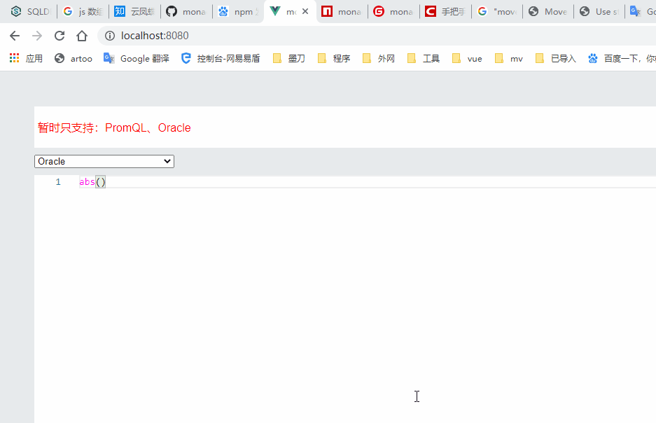

@see examples/App.vue

> 基于：[monaco-promql](https://github.com/prometheus-community/monaco-promql)
>
> support： oracle、promql

```shell
git clone https://gitee.com/browsers/monaco-languages-more.git

cd monaco-languages-more

# 安装依赖
npm i

# 运行
npm run dev

# 打包
npm run build:lib
```




#### 对外方法 | API

```javascript
// import * as languages from 'monaco-languages-more';
import * as languages from '../src/index.js';
// arg0: 注册语言
// arg1: 是否开启自动提示
languages.init(['oracle','promql'], true)


// ========================================================================
// monaco editor所支持的语言 + monaco-languages-more
// 支持别名 - alias
let getLang = 'Redis'
// 获取语言配置
// arg0: 别名
// arg1：是否忽略大小写
let lang = languages.getLanguage(getLang, true);
lang.loader().then((e)=>{
    console.log(getLang,'config：',e)
});

// ========================================================================
// 根据别名获取languageId
// arg0: 别名
// arg1：是否忽略大小写
let languageId = languages.getLanguageId('OraCle', true);


// ========================================================================
// 自定义别名
//export var _aliases = {
//	'go': ['go', 'golang', 'GO', 'GOLANG'],
//	'redis': ['redis', 'Redis', 'REDIS']
//}
//export const setAliases = function(aliases, append) {
//	if (!append) {
//		// false|undefined
//		_aliases = aliases;
//	} else {
//		_aliases = Object.assign(_aliases, aliases);
//	}
//	return _aliases;
//}

// arg0: 别名配置
// arg2: 是否追加。false
languages.setAliases({'go':['go','golang']}, true)

```

